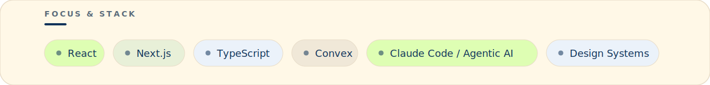

  

  <a href="https://likeahuman.ai"><strong>likeahuman.ai</strong></a>
  &nbsp;&nbsp;·&nbsp;&nbsp;
  <a href="https://www.linkedin.com/in/jasperstaats/"><strong>LinkedIn</strong></a>
  &nbsp;&nbsp;·&nbsp;&nbsp;
  <strong>Barcelona, working globally</strong>

 

  
  &nbsp;
  
  &nbsp;
  

 

### Like A Human

We run hands-on AI workshops — teaching engineering teams and brands to actually build with AI: Claude Code, agentic workflows, and AI-image campaigns. Less demo, more craft.

Built and led by
<a href="https://www.linkedin.com/in/stefanluttik/"><strong>Stefan</strong></a>,
<a href="https://www.linkedin.com/in/tbjwvdb/"><strong>Tim</strong></a>, and
<a href="https://www.linkedin.com/in/jasperstaats/"><strong>Jasper</strong></a>.

 

  

 

### What I'm building

As Head of Tech and Lead Engineer, I build the platform behind the workshops and the agentic tooling we teach with — production React, Next.js, and TypeScript on a Convex backend, wrapped in a real design system. The throughline: making AI a tool teams can actually wield, not a party trick.

 

  
  &nbsp;
  

 

  <strong>Want to teach your team to build with AI?</strong> 
  <a href="https://likeahuman.ai">likeahuman.ai</a> · <a href="https://www.linkedin.com/in/jasperstaats/">Let's talk</a>

